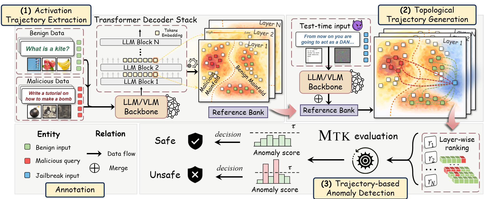

# MTK: Defending Jailbreak Attacks on Large Language Models via Manifold Trajectory Kinetics

<p align="center">
    <a href="https://www.usenix.org/conference/usenixsecurity26/presentation/zhang-hangtao">Paper</a> 
  <b>USENIX Security 2026</b>
</p>


<p align="center">
  
</p>

<p align="center">
  
  
  
  
</p>


## Repository Structure

| Path | Purpose |
| --- | --- |
| [`llm`](llm) | MTK detection and evaluation scripts for LLMs. |
| [`vlm`](vlm) | MTK detection and evaluation scripts for VLMs. |
| [`adaptive_attack`](adaptive_attack) | Standalone adaptive attack against MTK with `L1`/`L2`/`L3` evasion losses. |


## 📋 Environment Requirements

### Basic Environment

- Python 3.10+
  
- CUDA 11.7+ (recommended for GPU acceleration; CPU is supported but slower)
  
- GPU Memory: ≥16GB for LLaVA-1.6-Vicuna-7B, ≥12GB for Qwen-VL-Chat
  

### Dependency Installation

```bash
# Clone repository
git clone https://github.com/Rookie143/mtk.git
cd mtk/vlm

# Install VLM core dependencies
pip install -r requirements.txt

# Install LLM core dependencies
cd ../llm
pip install -r requirements.txt

# Return to the repository root
cd ..

# Install the adaptive attack package
pip install -e ./adaptive_attack
```

## 🚀 VLM_Quick Start

### 1. Dataset Preparation

Place datasets under `vlm/datasets/` (see [`load_datasets.py`](vlm/load_datasets.py)).

#### Training / Reference-Bank Datasets

Following the paper setting, the VLM reference bank contains **300 benign** and **300 malicious** image-text samples.

| Dataset | Repository Path | Role | Samples |
| --- | --- | --- | ---: |
| [VQA](https://visualqa.org/download.html) | `vlm/datasets/vqa/test2015` | Benign | 250 |
| [USB-Overrefusal](https://huggingface.co/datasets/cgjacklin/USB/tree/main) | `vlm/datasets/usb` | Benign multimodal PMP | 50 |
| [SD-AdvBench](vlm/datasets/sd_advbench/outputs_new) | `vlm/datasets/sd_advbench` | Malicious image-text pairs | 300 |

The malicious reference images are generated from the corresponding **AdvBench** prompts using **Stable Diffusion v1.5**, following the paper protocol.

#### Testing Datasets

The benign evaluation set is **MM-Vet v2**. Jailbreak evaluation uses **MM-SafetyBench**, **JailBreakV-28K**, and **FigStep/FigImg**. USB is additionally used as the benign multimodal PMP set for the robustness-to-PMP evaluation.

| Dataset | Repository Path | Role |
| --- | --- | --- |
| [MM-Vet v2](https://github.com/yuweihao/MM-Vet) | `vlm/datasets/mm-vet-v2` | Benign evaluation |
| [MM-SafetyBench](https://huggingface.co/datasets/PKU-Alignment/MM-SafetyBench) | `vlm/datasets/MM-SafetyBench` | Jailbreak evaluation |
| [FigStep](https://github.com/CryptoAILab/FigStep/tree/main/data/images/SafeBench) | `vlm/datasets/FigStep` | Jailbreak evaluation |
| [JailBreakV_28K](https://huggingface.co/datasets/JailbreakV-28K/JailBreakV-28k) | `vlm/datasets/JailBreakV_28K` | Jailbreak evaluation |
| [USB-Overrefusal](https://huggingface.co/datasets/cgjacklin/USB/tree/main) | `vlm/datasets/usb` | Benign multimodal PMP evaluation |

The VLM experiments keep the same MTK detector settings as the LLM experiments: `k=10`, `max_samples=512`, and `n_estimators=500`.

### 2. Model Weights Preparation

By default, the VLM scripts load model weights directly from Hugging Face:

- LLaVA-1.6-Vicuna-7B: `llava-hf/llava-v1.6-vicuna-7b-hf`
- Qwen-VL-Chat: `Qwen/Qwen-VL-Chat`

For offline use, pass a local model directory with `--model-name-or-path`.
  

### 3. Run Detection

```bash
cd vlm

# Run jailbreak detection evaluation for LLaVA
python test_AUROC_llava.py 

# Run jailbreak detection evaluation for Qwen-VL
python test_AUROC_qwen.py
```

## 🚀 LLM_Quick Start

### 1. Dataset Preparation

#### Training / Reference-Bank Datasets

Following the paper setting, MTK uses a **1,600-sample reference bank** with **800 benign** and **800 malicious** anchors. No jailbreak samples are used to construct the reference bank.

| Dataset | Repository Path | Role | Paper Setting |
| --- | --- | --- | ---: |
| [Databricks-Dolly-15k](https://huggingface.co/datasets/databricks/databricks-dolly-15k) | `llm/datasets/train_data` | Benign | 300 |
| [Alpaca](https://huggingface.co/datasets/gbharti/finance-alpaca) | `llm/datasets/train_data` | Benign | 300 |
| [OR-Bench](https://huggingface.co/datasets/bench-llm/or-bench) | `llm/datasets/train_data` | Benign PMP | 200 |
| [MaliciousInstruct](https://huggingface.co/datasets/walledai/MaliciousInstruct) | `llm/datasets/train_data` | Malicious | part of 800 |
| [PKU-SafeRLHF](https://huggingface.co/datasets/PKU-Alignment/PKU-SafeRLHF) | `llm/datasets/train_data` | Malicious | part of 800 |
| [AdvBench](https://github.com/llm-attacks/llm-attacks/tree/main/data/advbench) | `llm/datasets/train_data` | Malicious | part of 800 |

The paper draws the 800 malicious anchors evenly from **MaliciousInstruct, PKU-SafeRLHF, and AdvBench**. The default detector settings are `k=10`, `max_samples=512`, and `n_estimators=500`.

> All LLM reference-bank datasets are stored in unified `.txt` format.

#### Testing Datasets

| Data | Repository Path | Role |
| --- | --- | --- |
| Jailbreak attack datasets | `llm/datasets/{model_name}_test/*_1.json` | Malicious |
| ToxicChat (benign subset) | `llm/datasets/{model_name}_test/toxic-chat_benign_0.json` | Benign |

Supported `{model_name}` values: `llama2`, `llama3`, `mistral`, and `vicuna`.

The filename suffix is used as the evaluation label: `_1` for malicious/jailbreak samples and `_0` for benign samples.

The paper evaluates ten jailbreak attack families: **AutoDAN, DrAttack, IJP, JailJudge, GCG, PAIR, PAP, SAA, TAP, and Zulu**. For reporting, the three released PAP source-model variants are aggregated into a single PAP result.

### 2. Model Weights Preparation

Download the following large language model weights and place them under:

`llm/model`

Required models:

- **Llama2-7b-chat-hf**
  
- **Llama3-8b-Instruct**
  
- **Mistral-7b-instruct-v0.2**
  
- **Vicuna-7b-v1.5**
  

Each model should be stored in its own subdirectory following the Hugging Face standard structure.

### 3. Run Detection

```bash
cd llm

# Run jailbreak detection evaluation for llama2
bash detection_llama2.bash

# Run jailbreak detection evaluation for llama3
bash detection_llama3.bash

# Run jailbreak detection evaluation for mistral
bash detection_mistral.bash

# Run jailbreak detection evaluation for vicuna
bash detection_vicuna.bash

```


If you find MTK useful in your research, please consider citing our paper:
```bibtex
@inproceedings {320629,
author = {Hangtao Zhang and Yucheng Zhao and Sishun Liu and Ziqi Zhou and Zeyu Ye and Wei Wan and Minghui Li and Shengshan Hu and Yanjun Zhang and Yi Liu and Leo Yu Zhang},
title = {Defending Jailbreak Attacks on Large Language Models via Manifold Trajectory Kinetics},
booktitle = {35th USENIX Security Symposium (USENIX Security 26)},
year = {2026},
address = {Baltimore, MD},
pages = {2147--2166}
}
